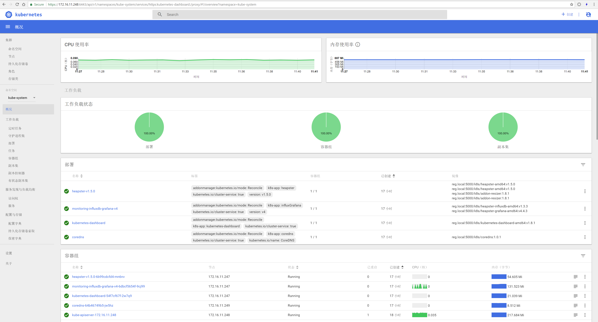

# Deploy


Online Vedio<br>
https://www.bilibili.com/video/av18457856/<br>
https://www.youtube.com/watch?v=84XvO2UAx9U&index=1&t=26s&list=PLUWlqkQl49xTY0-2JBYyrtqHaUgAToF3I


# Prepare

## 1). Config
Modify Machine Name&IP<br>
./hosts

Modify k8s Cluster Config<br>
./coreos/group_vars/systech

## 2). HTTP_SERVER
http://172.16.11.235/k8s<br>
Check the server contians these files：
```bash
etcd-v3.2.11.tgz
flannel-v0.9.1.tgz
hyperkube-v1.9.0.tgz
kubectl-v1.9.0.tgz
registry-2.6.2.tgz
registry-data-v1.9.0.tgz
```

BAIDU DISK<br>
Link：https://pan.baidu.com/s/1bqWrH51 <br>
Password：56lc


# Install

## 1).run ansible from docker
```cmd
docker run `
--name ansible `
-h ansible `
-v c:/git/github.com/ansible/:/etc/ansible `
-d hub.c.163.com/mengkzhaoyun/public:ansible-2.3.0-centos7 /bin/sh -c "while true; do echo hello world; sleep 1; done"
```

## 2).enter in ansible cotainer
```bash
# enter contianer run ansible scripts
docker exec -it ansible bash

# exec commands to install k8s 
cd coreos
ap a.bootstrap.yml
ap b.install.yml
ap c.test.yml
```

## 3).check
```bash
# check rkt
rkt list
UUID            APP             IMAGE NAME                                              STATE   CREATED         STARTED         NETWORKS
327b3c3a        flannel         hub.c.163.com/mengkzhaoyun/k8s:flannel-v0.9.1           running 10 minutes ago  10 minutes ago
34dffd22        registry        hub.c.163.com/mengkzhaoyun/public:registry-2.6.2        running 11 minutes ago  11 minutes ago  default:ip4=172.16.28.2
43ff3c33        k8s             hub.c.163.com/mengkzhaoyun/k8s:hyperkube-v1.9.0         running 8 minutes ago   8 minutes ago
8550c4d1        flannelopts     hub.c.163.com/mengkzhaoyun/k8s:flannel-v0.9.1           exited  10 minutes ago  10 minutes ago
ed48d2c4        etcd            coreos.com/etcd:v3.2.11                                 running 11 minutes ago  11 minutes ago


# check docker
docker ps

# check kube-system
kubectl get pods -n=kube-system

NAME                                    READY     STATUS    RESTARTS   AGE
kube-apiserver-172.16.11.248            1/1       Running   0          6m
kube-controller-manager-172.16.11.248   1/1       Running   0          6m
kube-proxy-172.16.11.247                1/1       Running   0          24s
kube-proxy-172.16.11.248                1/1       Running   0          6m
kube-proxy-172.16.11.249                1/1       Running   0          7m
kube-scheduler-172.16.11.248            1/1       Running   0          6m

```

## 4).addons
Copy Addons To The Master Server
```bash
# coredns
kubectl create -f /etc/kubernetes/addons/coredns.yml 

# dashboard
kubectl create -f /etc/kubernetes/addons/dashboard.yml 

# heapster
kubectl create -f /etc/kubernetes/addons/heapster.yml 

# rbac-admin
kubectl create -f /etc/kubernetes/addons/rbac-admin.yml 
```

# Brower

https://172.16.11.248:6443/ui<br>
admin <br>
abc2018