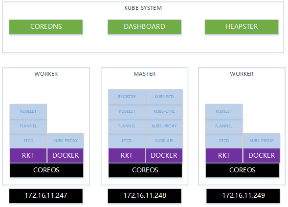

# 部署架构图



# 准备

## 1.修改配置文件
修改机器名和IP
./hosts

修改k8s集群配置
./coreos/group_vars/coreos

## 准备HTTP_SERVER
http://172.16.11.235/k8s
确保http服务器上有以下文件：
etcd-v3.2.11.tgz
flannel-v0.9.1.tgz
hyperkube-v1.9.0.tgz
kubectl-v1.9.0.tgz
registry-2.6.2.tgz
registry-data-v1.9.0.tgz

BAIDU
链接：https://pan.baidu.com/s/1qZi2jWo 密码：gekx


# 安装

## 1.run ansible from docker
```cmd
docker run `
--name ansible `
-h ansible `
-v c:/git/github.com/ansible/:/etc/ansible `
-d hub.c.163.com/mengkzhaoyun/public:ansible-2.3.0-centos7 /bin/sh -c "while true; do echo hello world; sleep 1; done"
```

## 2.in ansible docker bash
```bash
cd coreos
ap a.bootstrap.yml
ap b.bootstrap.yml
ap c.test.yml
```

## 3.check
```bash
# check rkt
rkt list

# check docker
docker ps

# check kube-system
kubectl get pods -n=kube-system
```

## 4.addon
```bash
# coredns
kubectl create -f /etc/kubernetes/addon/coredns.yml 

# dashboard
kubectl create -f /etc/kubernetes/addon/dashboard.yml 

# heapster
kubectl create -f /etc/kubernetes/addon/heapster.yml 
```

## open chrome
https://172.16.11.248:6443/api/v1/namespaces/kube-system/services/http:kubernetes-dashboard:/proxy