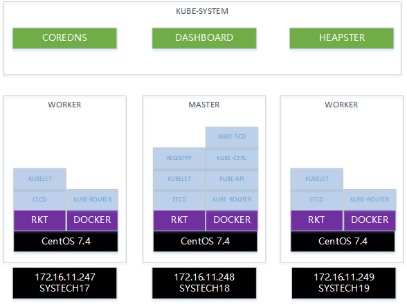
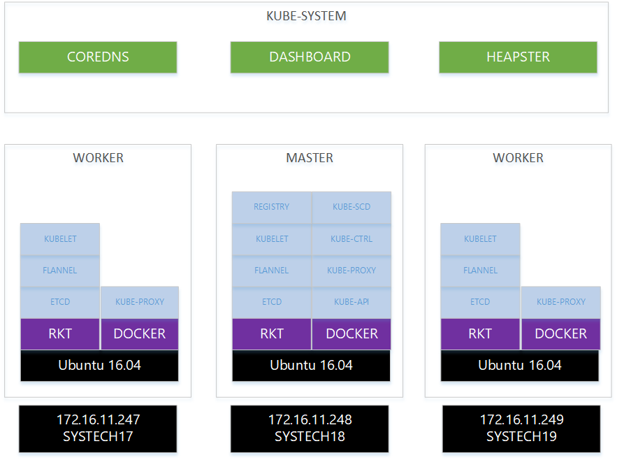

# Offline Auto Deploy

## CentOS

os: CentOS Linux release 7.4.1708 (Core)<br>
cotianer: docker 1.13.1 , rkt 1.29.0<br>
etcd: 3.3.2<br>
kubernetes: 1.9.4<br>
kubernetes-network: kube-router:v0.1.0-rc2<br>
kubernetes-addons: coredns:1.1.0 , dashboard:v1.8.3 , heapster:v1.5.0

[Offline Auto Deploy Kubernetes 1.9.4 in CentOS](./docs/centos.md)



Online Vedio<br>
https://www.bilibili.com/video/av20919490/<br>
https://youtu.be/_vhBCMwQsu8

## Ubuntu

[Offline Auto Deploy Kubernetes 1.9.3 in Ubuntu](./docs/ubuntu.md)



Online Vedio<br>
https://www.bilibili.com/video/av20150387/<br>
https://www.youtube.com/watch?v=144Ng2D5jxQ

## CoreOS

[Offline Auto Deploy Kubernetes 1.9.0 in CoreOS](./docs/coreos.md)


Online Vedio<br>
https://www.bilibili.com/video/av18457856/<br>
https://www.youtube.com/watch?v=84XvO2UAx9U

# How to Create Install Datas

## 1.9.6
BAIDU DISK <br>
Link：https://pan.baidu.com/s/1JPdHS9uz6p36hjV5uVPq_A <br>
Pass：jfws

## Get Images

[images.md](./docs/installs/images_v1.9.6.md)
```bash
# registry
docker pull registry:2.6.2

# etcd
docker pull quay.io/coreos/etcd:v3.3.2

# pause
docker pull gcr.io/google_containers/pause:3.1

# hyperkube
docker pull gcr.io/google_containers/hyperkube:v1.9.6

# flannel
docker pull quay.io/coreos/flannel:v0.10.0

# kube-router
docker pull cloudnativelabs/kube-router:v0.1.0

# busybox
docker pull gcr.io/google_containers/busybox:1.27.2

# coredns
docker pull coredns/coredns:1.1.0

# dashboard
docker pull gcr.io/google_containers/kubernetes-dashboard-amd64:v1.8.3
```

## Get ACI Image

[aci.md](./docs/installs/aci_v1.9.6.md)

```bash
rkt image export hub.c.163.com/mengkzhaoyun/public:registry-2.6.2 registry-2.6.2.aci

rkt image export hub.c.163.com/mengkzhaoyun/k8s:etcd-v3.3.2 etcd-v3.3.2.aci

rkt image export hub.c.163.com/mengkzhaoyun/k8s:flannel-v0.10.0 flannel-v0.10.0.aci

rkt image export hub.c.163.com/mengkzhaoyun/k8s:hyperkube-v1.9.6 hyperkube-v1.9.6.aci
```

## Get CTL

[ctl.md](./docs/installs/ctl_v1.9.6.md)

```bash
# ct
https://github.com/coreos/container-linux-config-transpiler/releases/download/v0.4.2/ct-v0.4.2-x86_64-unknown-linux-gnu

# kubectl
https://storage.googleapis.com/kubernetes-release/release/v1.9.6/bin/linux/amd64/kubectl

# etcdctl
https://github.com/coreos/etcd/releases/download/v3.3.2/etcd-v3.3.2-linux-amd64.tar.gz
```

## Get Registry Data

[registry.md](./docs/installs/registry_v1.9.6.md)